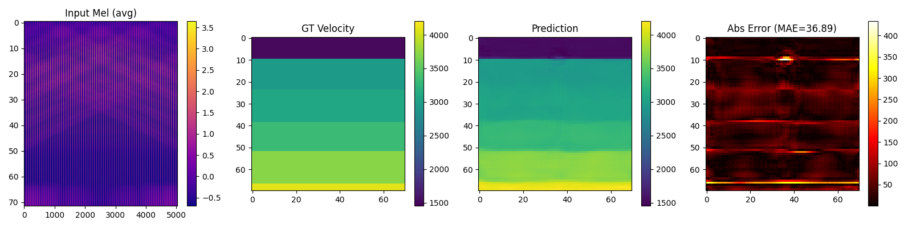

# OpenFWI EnsembleNet

A deep learning pipeline for seismic velocity inversion using ConvNeXt and spectrogram-based signal representations.

---

## Overview

This project was developed as part of my personal research on representation of signals. It explores the application of 2D Mel-spectrograms to seismic full waveform inversion (FWI) using the Yale OpenFWI dataset.

Inspired by and adapted from [Brendan Artley’s Kaggle baseline](https://www.kaggle.com/code/brendanartley/convnext-full-resolution-baseline).
(Data from [seshurajup's work](https://www.kaggle.com/datasets/seshurajup/waveform-inversion-1))
---

## Features

- Mel-spectrogram preprocessing 
- ConvNeXt backbone  
- U-Net-style decoder with SCSE attention

## Installation
```bash
pip install -r requirements.txt
```

## Usage
```bash
python scripts/train.py --config config.yaml
```

## YAML Config Example
Example `config.yaml` (use `families` to limit dataset subsets):
```yaml
# Dataset setting
data_dir: /your/data/path # path to data
batch_size: 32
num_parts: 31 # num of data to use
families: # specify dataset
  - FlatVel_A
  - FlatVel_B
  - Style_A
  - Style_B
  - CurveVel_A
  - CurveVel_B

# Training
epochs: 50
lr: 1.0e-3

# Huggingface setting
repo_id: yourname/repo

```

## Example Result
<p align="center">
  
</p>

> Spectrogram-based inversion shows promising alignment with ground truth in layered geological structures.

---

## Repository Structure
```
openfwi_ensemble/
├── configs/
│   └── config.yaml              # Training configuration
├── figures/
│   └── project04.png            # Mel-spectrogram & prediction visualization
├── models/                
│   └── __init__.py             # Model builder
│   └── ensemble.py
├── utils/                 # Scheduler, EMA, visualization
│   ├── ema.py
│   ├── optim.py
│   ├── scheduler.py
│   └── visualize.py
├── data/                  # Dataset and transforms
│   └── dataset.py
├── scripts/
│   └── train.py
├── requirements.txt
└── README.md
```

## License
MIT License